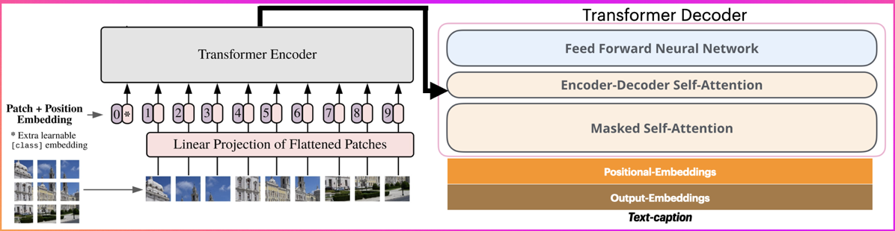
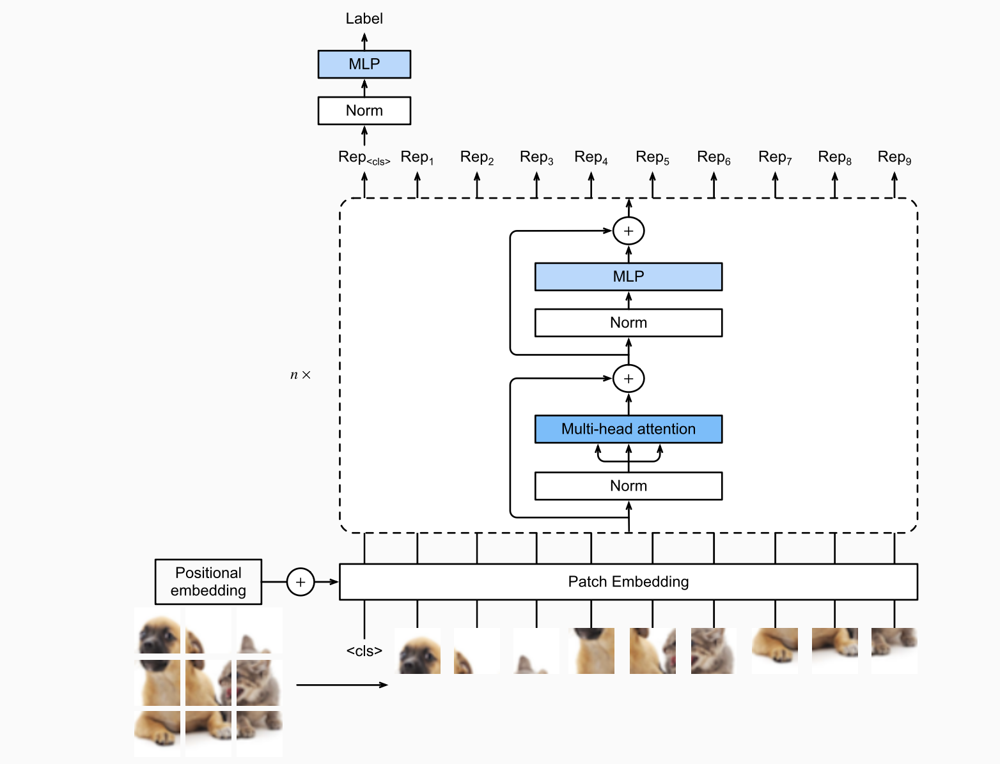

# Image Captioning with ViT-Transformer

- Report and Demo Video: [youtube](https://www.youtube.com/watch?v=_YmEE7AeT2I)
- Report Slide: [docs.google](https://docs.google.com/presentation/d/1ftbDiAB8QMPx44PnZB86KW2kN4vHtuO5/edit?usp=share_link&ouid=115750084992215091820&rtpof=true&sd=true)

# Outline:

## Overview Model Architecture
  
* Encoder: Vision Transformer  
* Decoder: Origial Transformer Architechture  
* Input: Image  
* Output: Sequence describe image  

## Encoder
  
* Patch Embedding
    * Separate original image to n patches (tokens)
    * Convert tokens to 1D tensor
* Encoder Block
    * Sublayer 1: Multi Head Attention to establish reationship between each patch (token)
    * Sublayer 2: MLP Handle, extract feature for individual patch
    * Residual connection, Norm: Simplizer model, avoid overfitting
* Output:
  * Number of patches vector represent feature of image
 
## Decoder
* Input:
    * Vector represent feature of image (output of encoder)
    * Previous predict sequence
* Encoder-Decoder Attention:
    * Attend to each patch of image
* Output:
  * Predict next token

## Demo model
* Use pre-train model: `nlpconnect/vit-gpt2-image-captioning`
* Deploy demo with gradio
